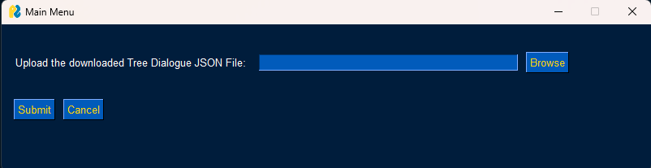
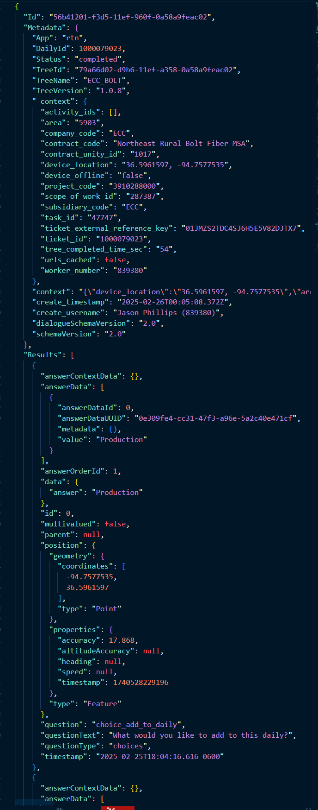
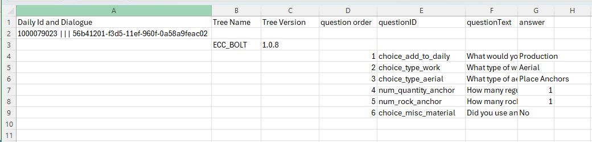

# Dialogue Reader
This program will create a visual friendly CSV/Excel file from a decision tree dialogue. :smiley:

# Inspiration 
Anyone who does not read programming languages on a regular bases may find reading JSON - even for being a human-read-able text language - to be intimidating. The information stored in our data files (decision tree dialogues) is cluttered with lists and dictionaries. Most of the time, not all the information stored is relevant to the cause. This program was built to pull and to organize the necessary information for the people on our team and for any subsidiary users. The format of CSV/Excel files are used and interprated universally. 

# Installation 
git clone the repository. 

Packages:
```
import pandas as pd
import json
import PySimpleGUI as sg
from pandas import json_normalize
from pathlib import Path
import argparse
```

You can run the program using PySimpleGUI if license installed. Please see **[run w/ PySimpleGUI](#run-w-pysimplegui)** for instructions on running the program using the GUI and visit **[Licenses](#licenses)** to learn how to acquire PySimpleGUI. 

or 

You can run the program through the command line by assigning the file location in variable 'p' on line 39. Reference **[run w/ file location](#run-w-file-location)**

## run w/ PySimpleGUI
Run the program by using: `py Dialogue_Reader.py -v`

Input a JSON file into the GUI window by clicking 'Browse'. The GUI will allow you to browse your computer files. Select the 'Tree_Dialogue_JSON_File.json' you wish to convert to CSV. Click 'Submit' and the new CSV file will be in your files where you set the directory in the terminal.

## run w/ file location
Run the program by using: `py Dialogue_Reader.py -c p`

The variable `p` should be assigned the location where the JSON file exists in the file path/directory. 

`p = Path(r'c:/Users/DV0095/Documents/Python_Projects/dialogues/test.json')`

The new CSV file will be in your files where you set the directory in the terminal.

## Licenses
Submit an Altas Request to get a developer key for the PySimpleGUI library. 'Request New Approved Software'. The library should be an option to select under the approved softwares.

Add developer key: Run the program with PySimpleGUI (**run w/ PySimpleGUI**) and the interface will prompt you to copy and paste the key into a text box. I believe a new key will be needed one calendar year after purchase.


# Name the CSV 
You can enter the name of your csv file on line 66.

`df.to_csv(f"{Dialogue_Id}_include_name.csv", index=False)`

The name of the file will automatically include the {Dialogue_Id} string at the beginning.

Replace 'include_name' with any name you would like to assign the CSV file for further uniqueness. If removed, the name of CSV will be just the {Dialogue_Id}.

# Visuals
Photo of the GUI Window.


Decision tree dialogue files look like this.


Example output of the program.



